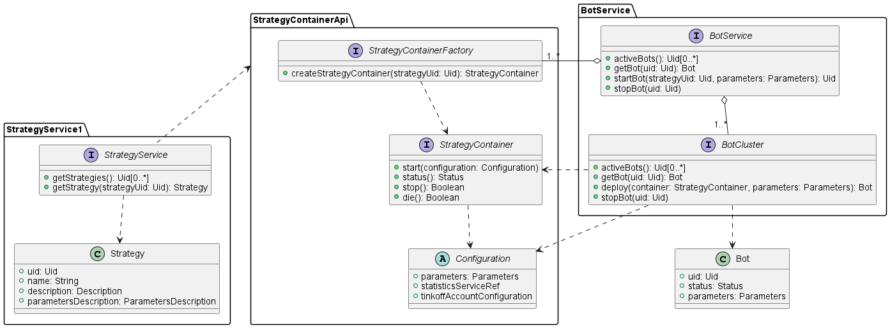

# Bot & Strategy Services Design

## Class Diagram

## BotService

Входная точка для сервиса ботов. Позволяет получать список ботов, запускать бота с определённой стратегией и параметрами и останавливать определённого бота.

Имплементация будет содержать список фабрик для контейнеров доступных стратегий.
Также предлагается хранить кластеры стратегий в зависимости от их типа, которые будут непосредственно обрабатывать операции с ботами.

### StrategyContainerFactory

Объекты данного типа умеют создавать контейнеры для определённой стратегии.
Их реализации предлагается хранить в модуле `strategies`.

### StrategyContainer

Объект, который реализует непосредственно логику старта стратегии, получения статуса и остановки. Также обладает методом `die()`, который должен принудительно останавливать стратегию и освобождать занятые ресурсы.

Реальный код стратегии может исполняться где угодно, в том числе в другом процессе, в докере или на другой машине. Контейнер должен лишь осуществлять запуск и общение со стратегией.
Код стратегии можно реализовать на другом языке и общаться, например, через RPC. `StrategyContainer` -- лишь некоторый фасад для общения с инстансом стратегии.

### BotCluster

Кластер ботов для контейнеров определённого вида. Создаёт бота на основе переданного `StrategyContainer`а, может выполнять внутренние оптимизации при создании нового бота.
Отвечает за удаление ботов и получение актуальной информации. Реализация должна быть согласованно с реализацией `StrategyContainer`а.

### Bot

Data class, соответствующий одному инстансу бота.

### Configuration

Абстрактный класс, соответствующий конфигурации, с которой будет запускаться бот для определённой стратегии.

## StrategyService

Входная точка для сервиса стратегий. Хранит описание доступных стратегий, но не их реализации.

Предполагается, что `StrategyService` будет сконфигурирован на основе реализованных стратегий.

### Strategy

Data class, соответствующий определённой стратегии.
- parametersDescription -- layout параметров стратегии.

